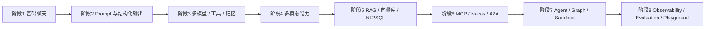

# Spring AI Alibaba Examples

> Spring AI Alibaba 主仓库：[alibaba/spring-ai-alibaba](https://github.com/alibaba/spring-ai-alibaba)  
> 官方网站：[java2ai.com](https://java2ai.com)  
> 网站仓库：[springaialibaba/spring-ai-alibaba-website](https://github.com/springaialibaba/spring-ai-alibaba-website)

[English](./README-en.md) | 中文

## 仓库定位

这个仓库不是单一 Demo，而是一套围绕 `Spring AI` 与 `Spring AI Alibaba` 组织起来的多模块示例集。  
我基于根 `pom.xml`、各级聚合 `pom.xml`、应用入口类、控制器以及各模块 README 做了完整梳理，可以把它理解成一份“按主题拆好的 Spring AI Alibaba 学习实验场”。

从根 `pom.xml` 可以确认本仓库主干使用：

- `Java 17`
- `Spring Boot 3.5.7`
- `Spring AI 1.1.0`
- `Spring AI Alibaba 1.1.0.0`
- `Spring AI Alibaba Extensions 1.1.2.1`

阅读时还需要注意两个事实：

1. 根聚合 `pom.xml` 直接管理了 `23` 个一级模块。
2. 仓库里还存在若干“可独立运行但未纳入根聚合”的目录，例如 `spring-ai-alibaba-playground`、`python-a2a-agent-example`，以及部分父目录下的补充示例。

## 推荐阅读方式

建议按下面顺序读代码，效率最高：

1. 先看根 `pom.xml`，知道一级主题划分。
2. 再看各聚合模块的 `pom.xml`，掌握子模块层级。
3. 然后看每个示例的 `Application`、`Controller`、`application.yml`。
4. 最后按自己的目标，挑对应模块深入读 README 和源码。

如果你只是想快速跑示例，常用命令如下：

```bash
# 构建整个仓库（跳过测试）
mvn -B package -DskipTests=true

# 运行单个模块
mvn -pl spring-ai-alibaba-helloworld spring-boot:run

# 运行某个子模块
mvn -pl spring-ai-alibaba-chat-example/dashscope-chat spring-boot:run
```

常见外部依赖位于 `docker-compose/`：

- `redis`
- `pgvector`
- `milvus`
- `mysql`
- `oceanbase`
- `es`
- `ollama`
- `zipkin`
- `mem0`
- `higress`

## 仓库模块地图

### 1. 基础入门与模型直连

- `spring-ai-alibaba-helloworld`
  - 作用：最基础的 `ChatClient` 入门模块。
  - 重点：同步调用、流式输出、`Advisor`、会话记忆、运行时 `ChatOptions`。

- `spring-ai-alibaba-chat-example`
  - 作用：不同模型平台/协议的聊天调用示例集合。
  - 子模块：
  - `dashscope-chat`：DashScope 聊天、流式调用、`ChatClient` 与 `ChatModel` 两种调用方式、多模态模型参数演示。
  - `deepseek-chat`：DeepSeek 模型接入。
  - `openai-chat`：OpenAI 模型接入。
  - `azure-openai-chat`：Azure OpenAI 接入。
  - `ollama-chat`：本地 Ollama 模型接入。
  - `zhipuai-chat`：智谱模型接入。
  - `vllm-chat`：自建 OpenAI 兼容端点接入。
  - `qwq-chat`：QwQ 推理模型接入。
  - `minimax-chat`：MiniMax 模型接入。

- `spring-ai-alibaba-prompt-example`
  - 作用：Prompt 组织方式示例。
  - 重点：角色提示词、Prompt Stuffing、提示词结构化组织。

- `spring-ai-alibaba-structured-example`
  - 作用：结构化输出示例。
  - 重点：JSON 输出、Bean 反序列化、`Map/List` 结果解析、模型原生 JSON 模式。

- `spring-ai-alibaba-multi-model-example`
  - 作用：同一应用内接多个模型或多个平台。
  - 子模块：
  - `dashscope-multi-model`：同平台多模型切换。
  - `ark-multi-model`：Ark 平台多模型切换。
  - `openai-dashscope-multi-model`：OpenAI 与 DashScope 混合接入。

- `spring-ai-alibaba-more-platform-and-model-example`
  - 作用：进一步演示“平台”和“模型”是两层概念。
  - 重点：按平台路由模型、按模型名动态切换。

- `spring-ai-alibaba-nacos-prompt-example`
  - 作用：把 Prompt 放进 Nacos 管理。
  - 重点：提示词外置化、动态配置、运行时热更新。

### 2. 工具调用、多模态与记忆

- `spring-ai-alibaba-tool-calling-example`
  - 作用：Function Calling / Tool Calling 入门示例。
  - 重点：天气、时间、地址、翻译、校园助手等工具调用；`FunctionToolCallback` 注册方式。

- `spring-ai-alibaba-chat-memory-example`
  - 作用：对话记忆存储实现对比。
  - 重点：`InMemory`、`MySQL`、`Redis`、`SQLite` 四种会话记忆方案。

- `spring-ai-alibaba-mem0-example`
  - 作用：Mem0 记忆接入示例。
  - 重点：长期记忆、外部记忆服务接入、记忆查询与回放。

- `spring-ai-alibaba-image-example`
  - 作用：图像生成与图像理解示例。
  - 子模块：
  - `dashscope-image`：DashScope 图像能力。
  - `openai-image`：OpenAI 图像能力。

- `spring-ai-alibaba-audio-example`
  - 作用：音频处理示例。
  - 子模块：
  - `dashscope-audio`：TTS、语音转文本、音频理解。

- `spring-ai-alibaba-video-example`
  - 作用：视频生成与视频问答示例。
  - 子模块：
  - `dashscope-video`：文生视频、视频问答。

- `spring-ai-alibaba-sandbox-example`
  - 作用：受控工具执行与浏览器型 Agent 安全运行示例。
  - 子模块：
  - `sandbox-simple-tool`：简单沙箱工具调用。
  - `sandbox-browser-fullstack`：浏览器 Agent 的全栈沙箱示例。

### 3. RAG、向量检索与 NL2SQL

- `spring-ai-alibaba-rag-example`
  - 作用：RAG 方向最完整的示例集合。
  - 子模块：
  - `module-rag`：RAG 基础增强、压缩、记忆、重写、翻译等 Advisor 级玩法。
  - `rag-component-example`：RAG 组件化使用。
  - `rag-etl-pipeline-example`：Reader、Transformer、Writer 组成的文档 ETL 流程。
  - `rag-parallel-example`：并行 RAG。
  - `rag-elasticsearch-example`：基于 Elasticsearch 的 RAG。
  - `rag-elasticsearch-autoconfigure-example`：Elasticsearch 自动配置方式。
  - `rag-milvus-example`：基于 Milvus 的 RAG。
  - `rag-pgvector-example`：基于 PGVector 的 RAG。
  - `rag-openai-dashscope-pgvector-example`：OpenAI + DashScope + PGVector 混合 RAG。
  - `langgraph-custom-rag-example`：图式编排的自定义 RAG。
  - `bailian-rag-knowledge`：对接百炼知识库。
  - `bailian-agent`：对接百炼智能体式 RAG。
  - `spring-ai-alibaba-vector-databases-example`：向量库专题集合。
  - `vector-simple-example`：最小向量检索示例。
  - `vector-redis-example`：Redis 向量检索。
  - `vector-opensearch-example`：OpenSearch 向量检索。
  - `vector-oceanbase-example`：OceanBase 向量检索。
  - `vector-neo4j-example`：Neo4j 图谱/向量结合。

- `spring-ai-alibaba-nl2sql-example`
  - 作用：自然语言转 SQL 及其上下游支撑示例。
  - 子模块：
  - `chat`：自然语言问数主流程。
  - `vector-management`：语义向量管理。
  - `mcp`：把 NL2SQL 能力通过 MCP 方式对外暴露或接入。

- `spring-ai-alibaba-bailian-example`
  - 作用：百炼平台综合集成示例。
  - 重点：百炼知识库、百炼智能体、长文档解析、文件上传分析。

### 4. MCP、协议集成与服务治理

- `spring-ai-alibaba-mcp-example`
  - 作用：MCP 方向最完整的示例集合。
  - 子模块：
  - `spring-ai-alibaba-mcp-starter-example`：基于 Starter 的快速接入方案。
  - `client/mcp-stdio-client-example`：STDIO 客户端。
  - `client/mcp-webflux-client-example`：WebFlux 客户端。
  - `client/mcp-sdk-streamable-client-example`：Streamable SDK 客户端。
  - `client/mcp-streamble-client`：流式客户端示例。
  - `client/mcp-streamable-webflux-client`：WebFlux Streamable 客户端。
  - `client/mcp-annotation-client`：注解式客户端。
  - `server/mcp-webflux-server-example`：WebFlux 服务端。
  - `server/mcp-stdio-server-example`：STDIO 服务端。
  - `server/mcp-streamable-webmvc-server`：WebMVC Streamable 服务端。
  - `server/mcp-streamable-webflux-server`：WebFlux Streamable 服务端。
  - `server/mcp-annotation-server`：注解式服务端。
  - `spring-ai-alibaba-mcp-manual-example`：手工构建 MCP 客户端/服务端。
  - `ai-mcp-github`：接 GitHub MCP。
  - `ai-mcp-fileserver`：文件系统 MCP。
  - `sqlite/ai-mcp-sqlite`：SQLite MCP。
  - `sqlite/ai-mcp-sqlite-chatbot`：SQLite 聊天机器人。
  - `spring-ai-alibaba-mcp-build-example`：不依赖 Starter 的底层构建方式。
  - `starter-stock-server`：自定义股票服务端。
  - `spring-ai-alibaba-mcp-nacos-example`：MCP + Nacos 注册发现。
  - `server/mcp-nacos-gateway-example`：MCP 网关。
  - `server/mcp-nacos-register-extensions-example`：服务注册与扩展元数据。
  - `client/mcp-nacos-distributed-extensions-example`：分布式扩展客户端。
  - `spring-ai-alibaba-mcp-auth-example`：MCP 认证链路。
  - `client/mcp-auth-client`：认证客户端。
  - `server/mcp-auth-web-server`：认证服务端。
  - `spring-ai-alibaba-mcp-config-example`：多源配置、配置优先级、REST 配置查询。

- `python-a2a-agent-example`
  - 作用：跨语言 A2A 示例。
  - 重点：Python Agent 通过 Nacos 注册，Java/Spring Boot 侧发现并调用。
  - 补充目录：`saa-caller-example` 是 Java 调用端。

### 5. Agent、Graph 与复杂编排

- `spring-ai-alibaba-agent-example`
  - 作用：Agent 能力专题集合。
  - 父模块聚合的子模块：
  - `playground-flight-booking`：订票场景 Agent，全栈演示。
  - `react-agent-example`：ReAct Agent 基础模式。
  - `rag-agent-example`：带知识检索的 Agent。
  - `sql-agent-example`：SQL Agent。
  - `adk-samples-llm-auditor`：LLM 审核/审计场景。
  - `voice-agent-dashscope-sdk-example`：基于 DashScope SDK 的语音 Agent。
  - `voice-agent-example`：通用语音 Agent。
  - 目录内还存在但未纳入父 `pom.xml` 聚合的补充示例：
  - `a2a-client-example`：A2A 客户端。
  - `a2a-server-example`：A2A 服务端。
  - `subagent-personal-assistant-example`：子 Agent 个人助理。
  - `skills-agent-example`：技能式 Agent。

- `spring-ai-alibaba-graph-example`
  - 作用：`spring-ai-alibaba-graph` 工作流/图编排专题集合。
  - 子模块：
  - `workflow-review-classifier`：评审分类工作流。
  - `workflow-writing-assistant`：写作助手工作流。
  - `multiagent-openmanus`：多 Agent 协同。
  - `stream-node`：流式节点。
  - `parallel-stream-node`：并行流式节点。
  - `parallel-node`：并行节点执行。
  - `mcp-node`：图节点中接 MCP。
  - `human-node`：人工介入节点。
  - `react`：图式 ReAct。
  - `reflection`：反思型图执行。
  - `chatflow`：聊天流编排。
  - `big-tool`：大工具编排。
  - `product-analysis-graph`：产品分析工作流。
  - `usecase-field-classifier`：领域分类工作流。
  - `interruptable-action-example`：可中断执行。
  - `issue-clarify-graph-example`：问题澄清流程。
  - `graph-observability-langfuse`：图执行可观测。

### 6. 业务场景、工程化与综合应用

- `spring-ai-alibaba-usecase-example`
  - 作用：把基础能力落到具体业务问题上。
  - 父模块聚合的子模块：
  - `spring-ai-alibaba-scene-example`：场景化示例集合。
  - `multi-model-chat`：多模型业务对话。
  - `spring-ai-alibaba-sql-example`：SQL 生成与执行。
  - `spring-ai-alibaba-text-classification-example`：文本分类。
  - `spring-ai-alibaba-text-summarizer-example`：摘要生成。
  - `spring-ai-alibaba-translate-example`：翻译。
  - `spring-ai-alibaba-classification-grading-example`：分类 + 评分。
  - 目录内还存在但未纳入父 `pom.xml` 聚合的重要综合示例：
  - `spring-ai-alibaba-comprehensive-example`：覆盖客服、采购、PDF 处理、聊天历史等的综合业务应用。
  - `spring-ai-alibaba-comprehensive-example/chatAiDemo-frontend`：对应前端页面。
  - `spring-ai-alibaba-scene-example/frontend`：场景示例前端。

- `spring-ai-alibaba-observability-example`
  - 作用：模型调用可观测专题。
  - 子模块：
  - `observability-example`：基础观测能力。
  - `observability-arms-example`：接入阿里云 ARMS。
  - `observationhandler-example`：自定义 ObservationHandler。
  - `observability-langfuse-example`：接入 Langfuse。

- `spring-ai-alibaba-evaluation-example`
  - 作用：模型输出评测。
  - 重点：相关性、事实性、正确性、Faithfulness 等评测指标。

- `spring-ai-alibaba-playground`
  - 作用：全栈 Playground。
  - 重点：把聊天、RAG、工具调用、MCP、音频、图像、视频等能力统一到一个前后端应用里。
  - 注意：该目录有独立 `pom.xml`，但不在根聚合 `pom.xml` 中，需要单独构建运行。

## 核心功能与技能点

| 技能点 | 对应模块 | 你会学到什么 |
| --- | --- | --- |
| `ChatClient` 基础调用 | `spring-ai-alibaba-helloworld`、`spring-ai-alibaba-chat-example` | 同步调用、流式调用、参数覆盖、系统提示词 |
| `Advisor` 增强机制 | `spring-ai-alibaba-helloworld`、`module-rag`、`chat-memory` | 记忆、RAG、上下文增强 |
| Prompt 工程 | `spring-ai-alibaba-prompt-example`、`spring-ai-alibaba-nacos-prompt-example` | 角色设定、模板组织、配置中心管理 |
| 结构化输出 | `spring-ai-alibaba-structured-example` | JSON、Bean、集合映射 |
| 多模型 / 多平台 | `spring-ai-alibaba-multi-model-example`、`spring-ai-alibaba-more-platform-and-model-example` | 模型路由、平台切换、统一接口封装 |
| Tool Calling | `spring-ai-alibaba-tool-calling-example`、`graph-example/big-tool` | 工具注册、参数描述、工具协同 |
| Chat Memory | `spring-ai-alibaba-chat-memory-example`、`spring-ai-alibaba-mem0-example` | 短期记忆、长期记忆、外部记忆系统 |
| 多模态 | `image-example`、`audio-example`、`video-example` | 图像、语音、视频的生成与理解 |
| RAG 基础 | `module-rag`、`rag-component-example` | 检索增强、文档召回、问答增强 |
| 文档 ETL | `rag-etl-pipeline-example` | Reader、Transformer、Writer 流水线 |
| 向量数据库 | `vector-*`、`rag-*` | Redis、PGVector、Milvus、OpenSearch、OceanBase、Neo4j |
| NL2SQL | `spring-ai-alibaba-nl2sql-example`、`sql-agent-example` | 语义建模、向量检索、SQL 生成 |
| MCP | `spring-ai-alibaba-mcp-example`、`graph-example/mcp-node` | MCP 客户端/服务端、传输协议、注册发现、认证 |
| Agent | `spring-ai-alibaba-agent-example` | ReAct、RAG Agent、SQL Agent、语音 Agent、多 Agent |
| Graph / Workflow | `spring-ai-alibaba-graph-example` | 节点编排、并行执行、人工介入、反思、可中断 |
| A2A / 跨语言集成 | `python-a2a-agent-example`、`a2a-client-example`、`a2a-server-example` | 跨语言 Agent 通信、Nacos 注册发现 |
| 可观测 | `spring-ai-alibaba-observability-example`、`graph-observability-langfuse` | Tracing、指标、外部观测平台接入 |
| 评测 | `spring-ai-alibaba-evaluation-example` | 相关性、事实性、正确性评测 |
| 综合实战 | `spring-ai-alibaba-playground`、`spring-ai-alibaba-comprehensive-example` | 前后端整合、复杂业务串联、工程化落地 |

## 学习路径

### 学习路线选型

如果你的目标不同，建议这样选：

| 学习目标 | 推荐起点 | 优点 | 适用人群 |
| --- | --- | --- | --- |
| 先把 Spring AI Alibaba 跑通 | `helloworld` + `chat-example` | 上手最快，反馈最直接 | 初学者 |
| 想做企业知识库问答 | `module-rag` + `vector-*` + `rag-etl-pipeline-example` | 能系统掌握 RAG 全链路 | 做知识问答、文档问答的人 |
| 想做智能体系统 | `tool-calling-example` + `agent-example` + `graph-example` | 从工具到单 Agent，再到多 Agent/工作流 | 想做 AI Agent 编排的人 |
| 想做企业集成与协议互通 | `mcp-example` + `nacos-prompt-example` + `python-a2a-agent-example` | 贴近实际系统集成 | 平台工程、架构工程师 |

### 推荐主线



### 阶段 1：基础聊天调用

- 学什么：`ChatClient`、流式输出、系统提示词、运行时参数。
- 看哪些模块：
- `spring-ai-alibaba-helloworld`
- `spring-ai-alibaba-chat-example/dashscope-chat`
- `spring-ai-alibaba-chat-example/openai-chat`
- 完成标准：你能自己写出一个最小聊天接口，并知道 `ChatClient` 与 `ChatModel` 的区别。

### 阶段 2：Prompt 与结构化输出

- 学什么：Prompt 模板、角色提示词、结构化输出。
- 看哪些模块：
- `spring-ai-alibaba-prompt-example`
- `spring-ai-alibaba-structured-example`
- `spring-ai-alibaba-nacos-prompt-example`
- 完成标准：你能把模型输出约束成 JSON 或 Java 对象，并能把 Prompt 放到配置中心管理。

### 阶段 3：多模型、工具调用与记忆

- 学什么：模型切换、平台切换、函数工具调用、会话记忆。
- 看哪些模块：
- `spring-ai-alibaba-multi-model-example`
- `spring-ai-alibaba-more-platform-and-model-example`
- `spring-ai-alibaba-tool-calling-example`
- `spring-ai-alibaba-chat-memory-example`
- `spring-ai-alibaba-mem0-example`
- 完成标准：你能做一个“带工具调用 + 会话记忆”的聊天助手。

### 阶段 4：多模态能力

- 学什么：图像、音频、视频模型调用。
- 看哪些模块：
- `spring-ai-alibaba-image-example`
- `spring-ai-alibaba-audio-example`
- `spring-ai-alibaba-video-example`
- 完成标准：你能把文本、图片、音频、视频能力接成统一服务接口。

### 阶段 5：RAG、向量库与 NL2SQL

- 学什么：文档处理、向量检索、检索增强问答、问数。
- 看哪些模块：
- `spring-ai-alibaba-rag-example/module-rag`
- `spring-ai-alibaba-rag-example/rag-etl-pipeline-example`
- `spring-ai-alibaba-rag-example/spring-ai-alibaba-vector-databases-example`
- `spring-ai-alibaba-rag-example/rag-pgvector-example`
- `spring-ai-alibaba-nl2sql-example`
- `spring-ai-alibaba-bailian-example`
- 完成标准：你能做一个“文档导入 -> 向量化 -> 检索问答 -> SQL 问数”的完整链路。

### 阶段 6：MCP、Nacos 与 A2A

- 学什么：协议封装、工具服务化、注册发现、跨语言 Agent 通信。
- 看哪些模块：
- `spring-ai-alibaba-mcp-example/spring-ai-alibaba-mcp-starter-example`
- `spring-ai-alibaba-mcp-example/spring-ai-alibaba-mcp-manual-example`
- `spring-ai-alibaba-mcp-example/spring-ai-alibaba-mcp-nacos-example`
- `spring-ai-alibaba-mcp-example/spring-ai-alibaba-mcp-auth-example`
- `python-a2a-agent-example`
- 完成标准：你能把一个工具服务以 MCP 或 A2A 的形式暴露出去，并被别的应用发现调用。

### 阶段 7：Agent、Graph 与 Sandbox

- 学什么：ReAct、工作流编排、多 Agent 协同、人工节点、受控执行。
- 看哪些模块：
- `spring-ai-alibaba-agent-example/react-agent-example`
- `spring-ai-alibaba-agent-example/rag-agent-example`
- `spring-ai-alibaba-agent-example/sql-agent-example`
- `spring-ai-alibaba-graph-example`
- `spring-ai-alibaba-sandbox-example`
- 完成标准：你能做一个具备工具、知识、流程控制和安全边界的 Agent 系统。

### 阶段 8：可观测、评测与综合落地

- 学什么：Tracing、评测、前后端整合、复杂业务场景落地。
- 看哪些模块：
- `spring-ai-alibaba-observability-example`
- `spring-ai-alibaba-evaluation-example`
- `spring-ai-alibaba-playground`
- `spring-ai-alibaba-usecase-example`
- `spring-ai-alibaba-usecase-example/spring-ai-alibaba-comprehensive-example`
- 完成标准：你能把一个 AI 功能做成“可运行、可观测、可评估、可演示”的完整应用。

## 运行与构建建议

### 最适合初学者的起跑组合

```bash
mvn -pl spring-ai-alibaba-helloworld spring-boot:run
mvn -pl spring-ai-alibaba-chat-example/dashscope-chat spring-boot:run
mvn -pl spring-ai-alibaba-prompt-example spring-boot:run
mvn -pl spring-ai-alibaba-structured-example spring-boot:run
```

### 适合做 RAG 的组合

```bash
mvn -pl spring-ai-alibaba-rag-example/rag-pgvector-example spring-boot:run
mvn -pl spring-ai-alibaba-rag-example/rag-etl-pipeline-example spring-boot:run
mvn -pl spring-ai-alibaba-nl2sql-example/chat spring-boot:run
```

### 适合做 Agent / Workflow 的组合

```bash
mvn -pl spring-ai-alibaba-tool-calling-example spring-boot:run
mvn -pl spring-ai-alibaba-agent-example/react-agent-example spring-boot:run
mvn -pl spring-ai-alibaba-graph-example/workflow-writing-assistant spring-boot:run
```

## 补充说明

- 部分目录包含前端工程，重点有：
- `spring-ai-alibaba-playground/frontend`
- `spring-ai-alibaba-agent-example/playground-flight-booking/frontend`
- `spring-ai-alibaba-usecase-example/spring-ai-alibaba-scene-example/frontend`
- `spring-ai-alibaba-usecase-example/spring-ai-alibaba-comprehensive-example/chatAiDemo-frontend`

- 部分示例依赖本地中间件或外部服务，优先查看：
- 对应模块的 `README.md`
- 对应模块的 `src/main/resources/application.yml`
- 根目录 `docker-compose/`

- 如果你要系统学习，不建议一开始就读 `playground` 或 `comprehensive-example`，那两个更适合在前面能力点都掌握后拿来串联全链路。

## 一句话总结

如果把这个仓库按学习价值压缩成一句话：  
它本质上是一套从“模型调用”到“RAG / MCP / Agent / Workflow / 观测 / 评测 / 综合应用”的 Spring AI Alibaba 全景示例仓库。
